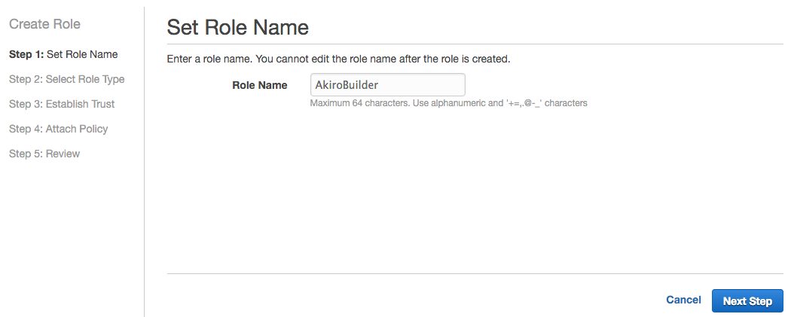
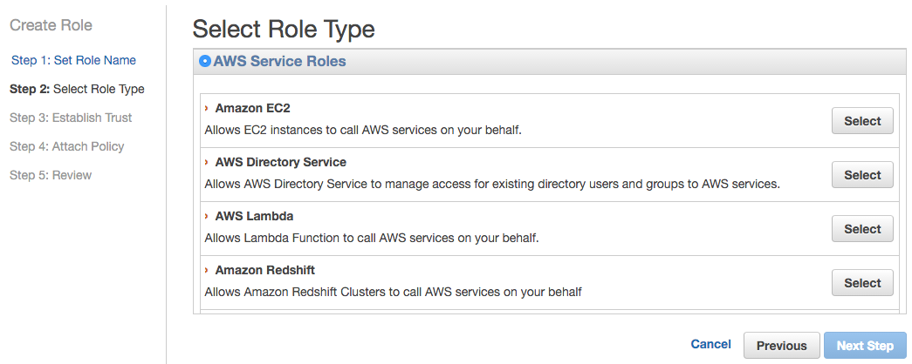
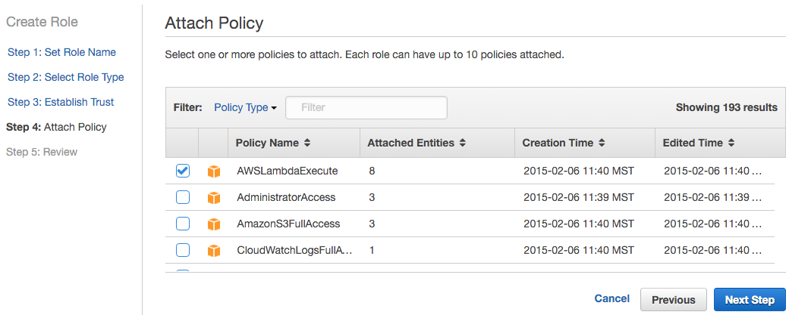

# [Akiro.js](../README.md) Getting Started: AWS IAm Role Setup

1. **Log into your `AWS Console`.**
2. **Go to the `IAm Service Console`.**
3. **Click `Roles` on the left.**
4. **Click the `Create New Role` button.**
5. **Type in any `Role Name` you want:**
	
6. **Click on `Select` next to `AWS Lambda`:**
	
7. **Check the box next to `AWSLambdaExecute` then click `Next Step`:**
	
8. Review your configuration, then click `Create Role`.

---

[Back to README.md](../README.md)
